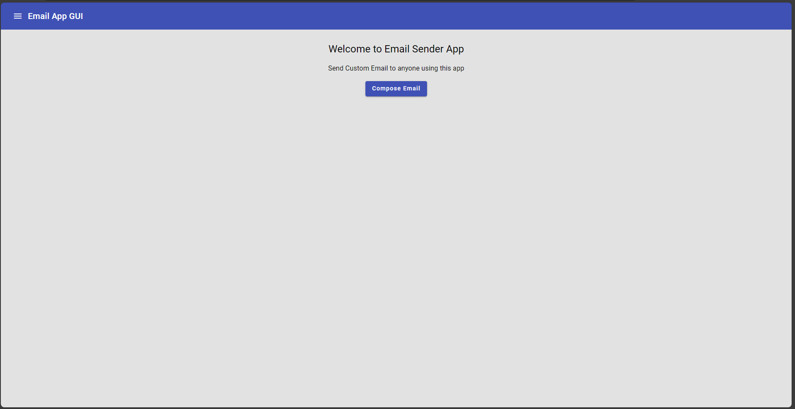
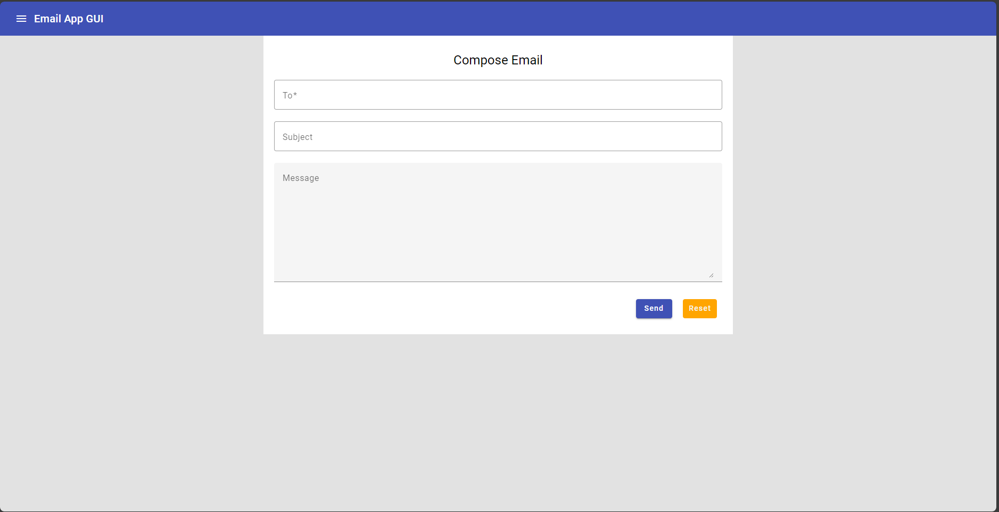

# Emailgui

This project was generated with [Angular CLI](https://github.com/angular/angular-cli) version 16.1.3.

It takes the sender's email, the subject, and the email body in the message as input and sends a real-time email to the receiver. After making an API call, it shows a notification message indicating whether it was successful or failed.

## GUI Images

## Development server

Run `ng serve` for a dev server. Navigate to `http://localhost:4200/`. The application will automatically reload if you change any of the source files.

## Build

Run `ng build` to build the project. The build artifacts will be stored in the `dist/` directory.
